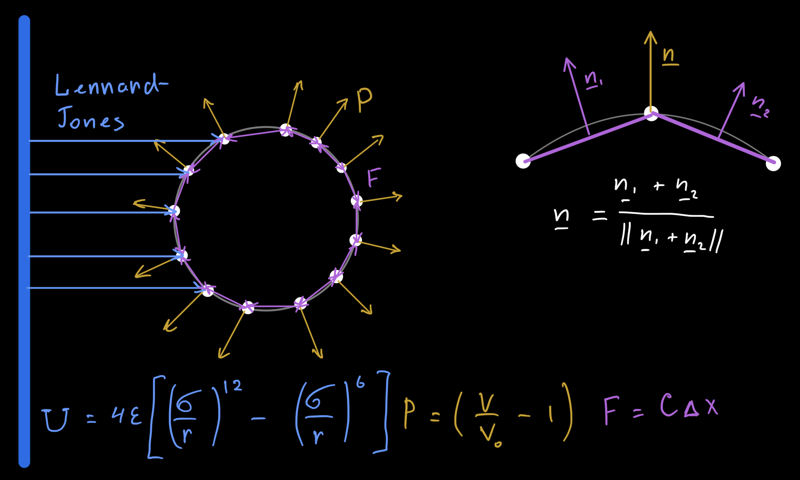

# Simulation of a balloon collision with a wall using the Lennard Jones potential
## [Demo](https://jhoysbou.github.io/BalloonModel/)

## Physics

The balloon is a set of a particles connected to each other with linear springs.\
The pressure is represented as P = k(V / V0 – 1).

The forces applied to particles:

## Simulation

The simulation is written in Typescript and supports two parameters.
The number of particles in a model and a radius of the balloon.

